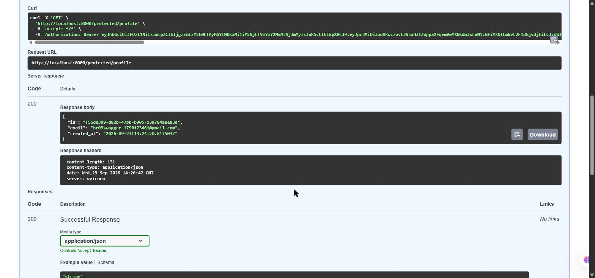
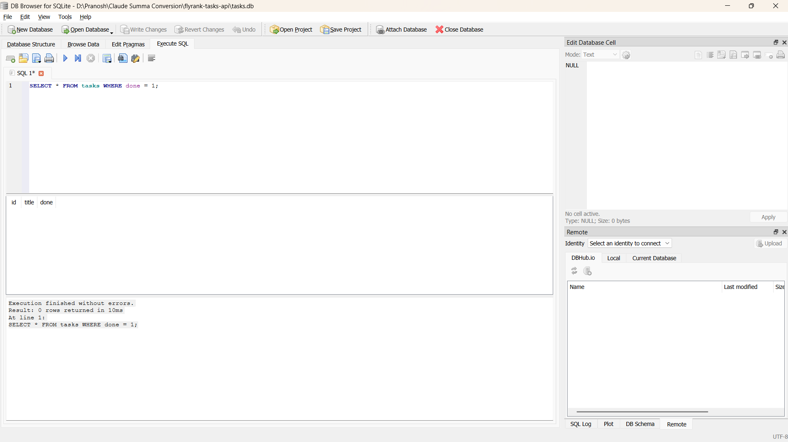

# Tasks API

A tiny CRUD API for managing a to-do list. FlyRank Backend Engineering Internship — Assignment A1 (in-memory), Assignment A2 (SQLite), Assignment A3/BE-04 (containerized, Postgres), BE-03/A4 (Supabase Auth — sign up, log in, log out, protected routes), BE-05/A9 (a separate polite scraper — see [`scraper/README.md`](scraper/README.md)), BE-07/A17 (an LLM behind `/enrich` — see below), BE-08/A8 (a separate PDF report generator — see [`pdf-reports/README.md`](pdf-reports/README.md)).

## Setup — environment variables

```bash
cp .env.example .env
```

Then fill in `.env` with your own values (never commit this file — it's git-ignored):

| Variable | Where to get it |
|---|---|
| `POSTGRES_USER` / `POSTGRES_PASSWORD` / `POSTGRES_DB` | Pick anything — used only by the local Docker Postgres container |
| `DATABASE_URL` | Set automatically for Docker (`db` is the compose service name); leave unset to fall back to SQLite locally |
| `SUPABASE_URL` | Your Supabase project → **Project Settings → API Keys** → Project URL |
| `SUPABASE_KEY` | Same page → **Publishable key** (never the **Secret key** — that bypasses all security) |
| `PORT` | `8000` for local FastAPI dev |
| `LLM_BASE_URL` / `LLM_API_KEY` / `LLM_MODEL` | BE-07 — any OpenAI-compatible provider. Used here: Gemini's compat endpoint, model `gemini-3.5-flash-lite` |
| `LLM_STUB` | `1` skips the model entirely and returns a fixed schema-valid response (for fast local dev) |
| `LLM_ENABLED` | `false` is the kill switch — `/enrich` returns `503` without calling the model |

One-time Supabase dashboard setting for local testing: **Authentication → Sign In / Providers → Email → turn off "Confirm email"**, so a fresh signup can log in immediately (leave this on in a real production project).

## Run it — Docker (Postgres, the real stack)

```bash
docker compose up -d --build
curl http://localhost:8000/tasks
```

That's the whole stack: Postgres with a persistent volume, and the API, started with one command. `docker compose down` stops both containers but keeps the volume, so data survives; add `-v` only if you actually want to wipe it.

## Run it — locally without Docker (SQLite, for quick local dev)

```bash
pip install -r requirements.txt
uvicorn main:app --reload
```

With no `DATABASE_URL` set, the app falls back to the SQLite repository from Assignment A2 — same routes, same behaviour, different storage. That fallback is what "the architecture proves itself" actually means here: `get_repository.py` is the *only* file that decides which backend to use; `main.py`'s routes never change either way.

## Endpoints

| Method | Path | Auth required? | Behaviour |
|--------|------|:---:|---|
| POST | `/auth/signup` | No | Create a Supabase user, `201` on success, `400` if `email`/`password` missing |
| POST | `/auth/login` | No | Log in via Supabase, `200` + `access_token`/`refresh_token`, `401` on bad credentials |
| POST | `/auth/logout` | **Yes** | Revoke the caller's Supabase session, `204` on success |
| GET | `/public/info` | No | `200`, no auth needed |
| GET | `/protected/profile` | **Yes** | `200` with `id`/`email`/`created_at`, `401` if the bearer token is missing/invalid/expired |
| GET | `/protected/dashboard` | **Yes** | Same guard as `/protected/profile`, proves the auth middleware is reusable |
| GET | `/tasks` | No | List all tasks |
| GET | `/tasks/{id}` | No | Get one task, `404` if it doesn't exist |
| POST | `/tasks` | No | Create a task, `400` if `title` is missing |
| PUT | `/tasks/{id}` | No | Update a task, `404`/`400` as above |
| DELETE | `/tasks/{id}` | No | Delete a task, `404` if it doesn't exist |
| POST | `/enrich` | No | BE-07 — judge a scraped book record's audience, `200` + schema JSON on success, `400` on bad input (no model call), `422` if the model's answer can't be validated even after one repair attempt, `504`/`502` on a timed-out/failed model call |

Protected routes expect `Authorization: Bearer <access_token>` from `/auth/login`.

## Authentication (BE-03)

Supabase Auth is the Identity Provider — this app never hashes a password or signs a token itself; it only sends credentials to Supabase and verifies the tokens Supabase hands back (`supabase_client.py`).

- **`get_current_user`** (`main.py`) is the single reusable FastAPI dependency — every protected route just adds `Depends(get_current_user)`. It's registered against FastAPI's `HTTPBearer` security scheme, which is what makes the "Authorize" padlock appear on the right routes in Swagger and gives FastAPI's own `Bearer <token>` parsing instead of hand-rolled header slicing.
- **Logout** calls Supabase Auth's `/auth/v1/logout` REST endpoint directly with the caller's own token, rather than the SDK's `sign_out()` — that method acts on the *shared client's own* cached session, and this API is stateless (one client instance, many users), so it would silently no-op. Hitting the REST endpoint with the caller's token revokes that specific session, still using only the publishable key.
- **Swagger UI** at `/docs` shows a lock icon on every protected route; click **Authorize**, paste an `access_token` from `/auth/login`, and "Try it out" works directly from the browser:



## Architecture (BE-04)

```
main.py  →  TaskRepository (interface, repository.py)
                  ├── SQLiteTaskRepository    (used when DATABASE_URL is unset)
                  └── PostgresTaskRepository  (used when DATABASE_URL is set — Docker sets it)
```

`get_repository.py` is the single switch. Every route in `main.py` calls `repo.list_tasks()`, `repo.create_task(...)`, etc. — it has no idea which database is behind that call. Swapping SQLite for Postgres was a matter of adding `postgres_repository.py` and never touching a single route.

## Database

**SQLite (A2, local dev):** `tasks.db`, created automatically next to `main.py`, git-ignored. Zero setup — the whole database is one file, and the file is the backup.

**Postgres (A3/BE-04, the real stack):** runs in Docker with a named volume (`pgdata`), so data survives `docker compose down` and even the container being deleted and recreated. Table + seed data come from `db/init.sql`, which Postgres runs automatically — and only once ever — the first time it starts against an empty volume (that's Postgres's own `docker-entrypoint-initdb.d` mechanism, not custom code).

**Why Postgres over just staying on SQLite:** SQLite is one file on one machine — fine for a solo dev loop, wrong for anything with concurrent writers or that needs to run as a separate service other things connect to. Docker + Postgres is what makes this look like a real deployable stack instead of a demo, and every later week's work (jobs, caching, RAG) assumes this local stack exists.

**Connection string:** lives in `.env` (git-ignored), copied from the committed `.env.example`. `docker-compose.yml` passes it into the `app` container as `DATABASE_URL`; the `db` container gets `POSTGRES_USER`/`PASSWORD`/`DB` from the same file.

### Persistence proof (BE-04 requirement)

Verified directly, not assumed:

1. `docker compose up -d --build` — both containers start, `db` passes its healthcheck before `app` starts (via `depends_on: condition: service_healthy`).
2. `GET /tasks` → the 3 seeded rows, read live from Postgres.
3. `POST /tasks` a new row, `PUT` it to `done: true`.
4. `docker compose down` — **both containers are stopped and removed entirely** (not just the app).
5. `docker compose up -d` — fresh containers, same named volume.
6. `GET /tasks` → all 4 rows still there, including the one created and updated in step 3, with `done: true` intact.

That's a full container teardown, not a soft restart — the volume is what survived, which is the actual point of Assignment A2 → A3: the interface never changed, only which repository sits behind it.

## SQL explored by hand (Stage 4)

Ran directly against `tasks.db` with the server live, no restart, and confirmed through the running API:

```sql
UPDATE tasks SET done = 1 WHERE id = 2;
```

Before: `GET /tasks/2` → `{"id":2,"title":"Write README","done":false}`
Ran that `UPDATE` directly against the database file (same thing DB Browser does).
After, same running server, no restart: `GET /tasks/2` → `{"id":2,"title":"Write README","done":true}` — the API reflected the change instantly, because it and the database viewer read the exact same file.

Also confirmed in [DB Browser for SQLite](https://sqlitebrowser.org/) directly — `SELECT * FROM tasks WHERE done = 1;` against the freshly seeded database correctly returns 0 rows, since none of the three seed tasks start out done:



## BE-07 — /enrich: an LLM behind the API

**What it does, in one paragraph:** `/enrich` takes one book record from the BE-05 scraper's
output (title, genre, rating, price, availability text) and returns a judgement a human
currently makes by eye: who the book is likely for. It picks one of four audience
categories, writes a short inferred marketing blurb (never claiming to know the book's
actual plot — it was never given a description), and flags listing-quality concerns. The
answer always comes back in the same shape, validated against a schema, never as raw
model text.

**Try it:**
```bash
curl -X POST http://localhost:8000/enrich \
  -H "Content-Type: application/json" \
  -d '{"title":"Set Me Free","category":"Young Adult","rating":5,"price_gbp":17.46,"availability_text":"In stock (19 available)"}'
```
Real response (captured from an actual live call during this build):
```json
{"audience": "general_adult", "confidence": 0.7, "blurb": "A playful collection of verse for readers who enjoy poetry that doesn't take itself too seriously.", "quality_flags": [], "reason": "Poetry collections in this style are typically shelved for general adult readers, though some poetry of this kind also appeals to younger readers."}
```
(that response was for the `A Light in the Attic` / Poetry input, not the `Set Me Free` one above — both produce the same shape.)

Broken input:
```bash
curl -X POST http://localhost:8000/enrich \
  -H "Content-Type: application/json" \
  -d '{"title":"Set Me Free","category":"Young Adult"}'
```
```json
{"error":"rating: Field required"}
```
(400, before any model call is made.)

**Job card:** see [`JOB-CARD.md`](JOB-CARD.md) — input shape, output shape, the closed
lists, the "it must never" rules, and the when-unsure behaviour.

**Provider and model:** Gemini, via its OpenAI-compatible endpoint
(`https://generativelanguage.googleapis.com/v1beta/openai/`), model
`gemini-3.5-flash-lite`. Swapping providers is three env vars —
`LLM_BASE_URL`, `LLM_API_KEY`, `LLM_MODEL` — nothing else in the code changes.
`.env.example` documents both the Gemini values used here and the OpenRouter/Ollama
alternatives named in the brief.

**Eval result:** 3/8, prompt version `enrich-v1.md`, run 2026-09-24. All 5 failures were
provider errors (a `429` from running the 8 cases concurrently against a free-tier rate
limit, `503`s from genuine provider high-demand, and two timeouts) -- not one was a wrong
audience judgement. Every case that actually got a response from the model was scored
correctly. See `evals/cases.json` and `evals/run_eval.py`.

**Cost log for one real call:**
```
{"event": "llm_call", "prompt_version": "enrich-v1.md", "model": "gemini-3.5-flash-lite", "input_tokens": 781, "output_tokens": 82, "duration_ms": 31853, "repaired": false}
```
At roughly 780 input tokens and 80 output tokens per call, 10,000 requests/day on
`gemini-3.5-flash-lite`'s free tier would need far more quota than the free tier grants —
this endpoint is sized for development and small-scale use, not production volume, without
upgrading the plan or adding the in-memory cache described in the brief's optional extras.

**What surprised me building this:** the provider was genuinely, visibly unstable while
building and evaluating this endpoint — real 503 "high demand" errors, and single calls
that legitimately took 30-90 seconds even to succeed. That's not a bug I introduced; it's
exactly the instability Stage 4 exists to survive, and it showed up live, repeatedly,
while testing: the retry-then-clean-502 path, the timeout-then-504 path, and the eventual
200 with real content all happened for real during this build, not as a simulated
exercise. The retry policy (5xx/429/timeout retried with backoff, 400/401/403 never
retried) and the kill switch were both exercised against real failures, not synthetic
ones.

**Retries:** built my own logic (`llm/client.py`), not the SDK's silent default of 2 —
retries fire only on timeout, 429, and 5xx, with exponential backoff plus jitter (1s, 2s,
4s window). A 400/401/403 fails immediately with no retry, verified live with a
deliberately wrong API key (failed in well under a second).

**Swapping providers, tried for real:** mid-build I switched `LLM_BASE_URL`/`LLM_API_KEY`/
`LLM_MODEL` to a local Ollama install (already had `llama3.2:3b` and `llama3.2:1b` pulled)
specifically to dodge Gemini's instability. It didn't work cleanly: this laptop's GPU has
6GB VRAM, and Ollama's GPU offload failed to allocate even the 1B model's KV cache
(`cudaMalloc failed: out of memory`) — plausibly because it was competing with several
other GPU-using apps already running. Forcing CPU-only (`OLLAMA_NUM_GPU=0`) fixed the OOM
but the restarted server came up pointed at an empty model store rather than the existing
one, and untangling that wasn't worth the time against a submission deadline. Reverted to
Gemini, which already had a complete, real eval run. The three-env-var swap itself worked
exactly as advertised — the failure was local hardware/config, not the provider
abstraction — which is itself the point of the brief's "put the provider behind an
interface" stretch goal: the code didn't care which provider it was talking to.

**What I'd fix with another day:** actually get the Ollama path working (worth it for the
unlimited local quota alone), add the in-memory cache from the optional extras (this job's
inputs — scraped book records — genuinely do repeat across re-scrapes, so a
prompt-version-keyed cache would cut both latency and cost meaningfully), and try the
`response_format`/structured-output parameter to make malformed JSON impossible rather
than merely unlikely, given how much of Stage 3's repair logic exists specifically to
paper over that gap.

**AI vs me:** not attempted this session (bonus stage, optional).
