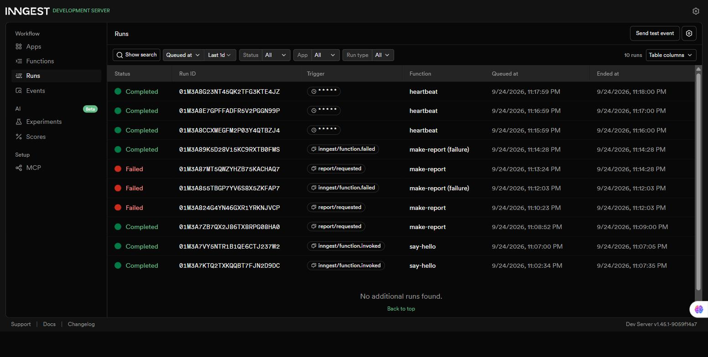

# Background job — FlyRank Backend Track, Week 4 (A7)

A small FastAPI service that answers instantly and does its slow work (an "8-second report") in a background job powered by [Inngest](https://www.inngest.com/), with a status endpoint to poll progress and one cron job that runs on the clock alone.

## What this is

- `GET /health` — plain request/response, proves the server is alive.
- `POST /reports` — the fast door: accepts a `{"topic": "..."}`, returns `202` with an id in well under a second, and hands the slow work to a background job.
- `GET /reports/{id}` — the status endpoint: `pending` → `done` (with the result) or `failed`. Unknown id → `404`.
- Three Inngest functions: `say-hello` (a warm-up job with a 5s sleep), `make-report` (the real background job — an 8s sleep step + a build step, with retries and a simulated failure path), `heartbeat` (a cron job that logs a pending/done/failed summary every minute).

## How to run it

Two terminals, two commands.

**Terminal 1 — the API:**
```bash
pip install -r requirements.txt
uvicorn main:app --port 8002
```

**Terminal 2 — the Inngest Dev Server:**
```bash
npx inngest-cli@latest dev -u http://localhost:8002/api/inngest
```

Then open the dashboard at `http://localhost:8288`. `.env.example` shows the one required variable (`INNGEST_DEV=1`, which tells the SDK to talk to the local Dev Server instead of Inngest Cloud) — copy it to `.env` before starting the API.

## Endpoints

| Method & path | What it does |
|---|---|
| `GET /health` | Returns `{"status": "ok"}` — proves the server is up. |
| `POST /reports` | Body `{"topic": "..."}`. Returns `202` + `{"id", "status": "pending"}` instantly. Missing/empty `topic` → `400`, no event sent. |
| `GET /reports/{id}` | Returns the saved report: `pending`, `done` + `result`, or `failed`. Unknown id → `404`. |

## Inngest functions

| Function | Trigger | What it does |
|---|---|---|
| `say-hello` | event `test/hello` | Sleeps 5s, returns `"Hello from the background!"` — the Stage 1 warm-up. |
| `make-report` | event `report/requested` | Sleeps 8s (`do-the-slow-work`), then runs `build-report`, which builds the result and marks the report `done`. If `topic == "fail"`, `build-report` raises and the run retries (`retries=2`, so 3 attempts total) before ending `Failed`; an `on_failure` handler marks the report `failed`. |
| `heartbeat` | cron `* * * * *` (every minute) | Counts `pending` / `done` / `failed` reports and logs one summary line. No endpoint, no event — the clock is the only trigger. |

## Proof — 202 then poll

Real `curl` output, topic `"cats"`:

```
$ time curl -s -i -X POST http://localhost:8002/reports -H "Content-Type: application/json" -d '{"topic":"cats"}'
HTTP/1.1 202 Accepted
content-type: application/json

{"id":"eb444c73-1e73-442e-8879-55acf02b3df7","status":"pending"}

real    0m0.292s
```

Poll immediately — still pending:
```
$ curl -s http://localhost:8002/reports/eb444c73-1e73-442e-8879-55acf02b3df7
{"id":"eb444c73-1e73-442e-8879-55acf02b3df7","topic":"cats","status":"pending"}
```

Poll ~10 seconds later — done, with the result:
```
$ curl -s http://localhost:8002/reports/eb444c73-1e73-442e-8879-55acf02b3df7
{"id":"eb444c73-1e73-442e-8879-55acf02b3df7","topic":"cats","status":"done","result":{"summary":"Report about cats","word_count":42}}
```

The `202` came back in 0.292s even though the report itself takes 8 seconds to build — the request stayed fast because the slow work moved into the background job.

## Stage 3 — validation vs. retry

A request with no `topic` is a bad input, not a bad moment — it will never succeed no matter how many times it's retried, so it's rejected at the door with `400` and never becomes a job; a `topic: "fail"` report *is* a bad moment (the kind of thing a real network hiccup causes), so Inngest retries it (3 attempts, with backoff) before giving up and marking the run `Failed`.

## Stage 4 — cron sentences

- Every day at 08:00 would be written as `0 8 * * *`.
- Every Sunday at 22:00 would be written as `0 22 * * 0`.

(Built and checked on [crontab.guru](https://crontab.guru).)

## Dashboard

All three functions, real runs: a completed `make-report` with its two steps, a `make-report` run that failed after 3 attempts (plus its `on_failure` sibling run), and three `heartbeat` cron runs one minute apart.


