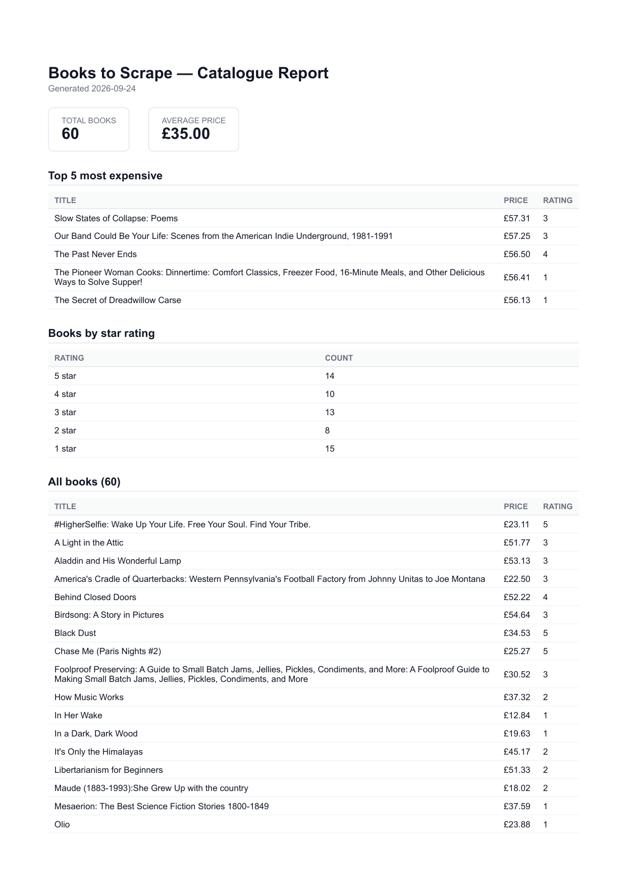

# PDF Report Generator (BE-08 / A8)

Query real data with SQL, render it into a real PDF report, and hand it out by link.
Python lane, FastAPI + SQLite + Playwright. Runs inline in the request &mdash; no background
job, per the brief (that wait is Stage 4's whole point).

## Dataset chosen

**Option B &mdash; the bookstore.** Reuses the 60 validated book records the scraper from
[BE-05 (the polite scraper)](../scraper/) collected from
[books.toscrape.com](https://books.toscrape.com/) into `scraper/output/books.json`. Real data,
already validated, no synthetic seeding needed.

## How to run it

```bash
cd pdf-reports
pip install -r requirements.txt
python -m playwright install chromium   # ~1 min, one-time

python seed.py                          # loads 60 books from ../scraper/output/books.json
uvicorn main:app --reload --port 8001
```

```bash
curl -X POST http://localhost:8001/reports
curl -o my-report.pdf http://localhost:8001/reports/1/file
```

## The aggregation SQL

```sql
SELECT COUNT(*) AS n FROM books;

SELECT AVG(price) AS avg_price FROM books;

SELECT title, price, rating, url FROM books ORDER BY price DESC LIMIT 5;

SELECT rating, COUNT(*) AS count FROM books GROUP BY rating ORDER BY rating DESC;
```

All four live in `queries.py`'s `get_report_data()`. Real output against the seeded data:

```json
{
  "total_books": 60,
  "average_price": 35.0,
  "top_5_expensive": [ /* 5 books, £57.31 down to £56.13 */ ],
  "by_rating": [
    {"rating": 5, "count": 14},
    {"rating": 4, "count": 10},
    {"rating": 3, "count": 13},
    {"rating": 2, "count": 8},
    {"rating": 1, "count": 15}
  ]
}
```
(5+4+3+2+1 star counts sum to exactly 60 &mdash; sanity-checked against `total_books`.)

## POST &rarr; download proof (real, from this machine)

```
$ time curl -i -X POST http://localhost:8001/reports
HTTP/1.1 201 Created
{"id":1,"file":"/reports/1/file"}
real  0m1.170s

$ curl -o my-report.pdf http://localhost:8001/reports/1/file
$ file my-report.pdf
my-report.pdf: PDF document, version 1.4, 3 page(s)
```

## Stage 4 sentence &mdash; when would this leave the request?

Once report generation regularly exceeds a couple of seconds or runs under real concurrent
load &mdash; a few users hitting `POST /reports` at once would each hold a Chromium instance
open inside the request, which doesn't scale. That's exactly the A7 background-job pattern
(the stretch goal).

## Stage 5 sentences &mdash; idempotency

**What the check protects against:** wasted work and inconsistent state from a double-clicked
button or a retried request &mdash; generating (and storing) the same report twice for no
reason. **Real-world cost example:** an e-commerce order-confirmation email sent twice because
a retry didn't check first &mdash; at scale that's not just annoying, it erodes trust in every
automated message the system sends afterward.

Verified live: two rapid `POST /reports` calls returned the same `id` both times (`200`, not
`201`) with exactly one new file in `reports/`; `{"force": true}` produced a genuinely new `id`
and a second file.

## Report, page 1



## Endpoints

| Method | Path | Behaviour |
|---|---|---|
| GET | `/health` | `200`, `{"status": "ok"}` |
| POST | `/reports` | Runs the full pipeline. `201` + `id` + file link on a fresh report; `200` + the existing `id` if one was already generated today (idempotent). `{"force": true}` skips the same-day check. |
| GET | `/reports/{id}` | The report record + file link. `404` on an unknown id. |
| GET | `/reports/{id}/file` | Serves the PDF from disk (`FileResponse`) &mdash; the only endpoint that moves file bytes. `404` if the id or file doesn't exist. |

## Architecture (store and link)

`POST /reports` never returns file bytes &mdash; only an `id` and a `/reports/{id}/file` link.
The PDF is written once to `reports/{id}.pdf` and the database only ever holds its path. JSON
responses stay a few bytes; only the dedicated file endpoint moves megabytes.

## Files

```
pdf-reports/
  main.py       FastAPI app: health, create/get/serve report
  db.py         SQLite connection + schema (books, reports)
  seed.py       loads books.json into report.db, safe to run twice
  queries.py    get_report_data() -- the four aggregations
  render.py     HTML template + Playwright PDF rendering
  reports/      generated PDFs (gitignored)
  report.db     SQLite file (gitignored)
```

`reports/` and `report.db` are gitignored &mdash; `seed.py` is the recipe, not the data.
